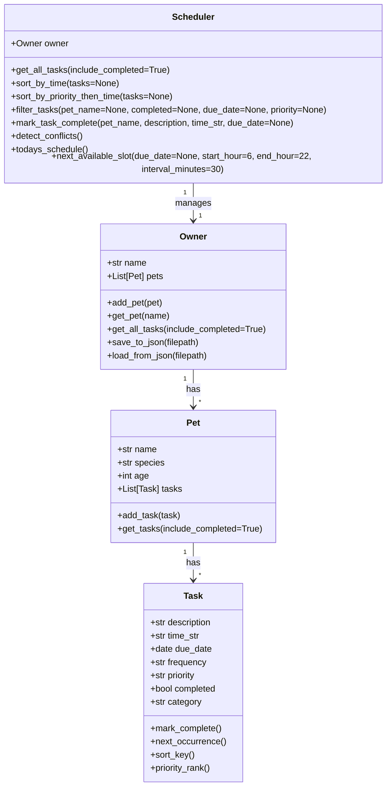

# PawPal+

PawPal+ is a CLI-first pet care management system built with Python OOP and a Streamlit UI. It helps one owner manage multiple pets, schedule care tasks, and use simple algorithms to keep the day organized.

## What the system does

PawPal+ lets a user:

- add and manage multiple pets
- schedule tasks such as feedings, walks, medications, grooming, play, and vet visits
- sort tasks across pets by time
- filter tasks by pet, completion status, date, and priority
- detect exact-time scheduling conflicts
- auto-create the next daily or weekly task when a recurring task is completed
- suggest the next available open slot on a day
- save and load pets and tasks with JSON persistence

## Core classes

### `Task`
Stores one pet care task.

Attributes:
- `description`
- `time_str`
- `due_date`
- `frequency`
- `priority`
- `completed`
- `category`

Key methods:
- `mark_complete()`
- `next_occurrence()`
- `sort_key()`
- `priority_rank()`

### `Pet`
Stores one pet and its tasks.

Attributes:
- `name`
- `species`
- `age`
- `tasks`

Key methods:
- `add_task(task)`
- `get_tasks(include_completed=True)`

### `Owner`
Stores the owner and all pets.

Attributes:
- `name`
- `pets`

Key methods:
- `add_pet(pet)`
- `get_pet(name)`
- `get_all_tasks(include_completed=True)`
- `save_to_json(filepath)`
- `load_from_json(filepath)`

### `Scheduler`
Acts as the logic layer across all pets.

Key methods:
- `get_all_tasks()`
- `sort_by_time()`
- `sort_by_priority_then_time()`
- `filter_tasks()`
- `mark_task_complete()`
- `detect_conflicts()`
- `todays_schedule()`
- `next_available_slot()`

## Smarter scheduling

The scheduler includes these algorithmic features:

1. **Chronological sorting**  
   Tasks are sorted by due date and time.

2. **Filtering across multiple pets**  
   Tasks can be filtered by pet, completion status, due date, and priority.

3. **Conflict detection**  
   The scheduler warns when two pets have tasks at the exact same date and time.

4. **Recurring task handling**  
   Completing a daily or weekly task automatically creates the next occurrence.

5. **Priority-based scheduling**  
   Tasks can also be sorted by priority first, then time.

6. **Next available slot suggestion**  
   The scheduler can suggest the next unused exact time slot on a given day.

## UML



## Agent Mode / AI-assisted implementation notes

I used AI in an agent-style workflow to help coordinate changes across the backend logic, CLI demo, tests, documentation, and Streamlit UI.

A good example was the addition of `next_available_slot()` and JSON persistence:
- the backend class design had to be updated in `pawpal_system.py`
- the CLI demo in `main.py` had to show the feature
- the Streamlit UI in `app.py` had to display the result and use saved data
- the README and tests had to be updated so the new behavior was documented and verified

AI was most useful for proposing step-by-step implementation order, generating draft code for each file, and helping keep the class design consistent while features were added incrementally. I still reviewed each change manually to make sure it matched the rubric and my final UML.

### Stretch features included

- **Advanced algorithmic capability:** `next_available_slot()` suggests the next open exact time slot on a day
- **Data persistence layer:** pets and tasks are saved and loaded with JSON
- **Advanced scheduling logic:** tasks can be sorted by priority and then time
- **Professional formatting:** the CLI and Streamlit app use cleaner tables, emojis, and readable status labels

## Files

- `pawpal_system.py` — backend logic and classes
- `main.py` — CLI demo script
- `app.py` — Streamlit interface
- `tests/test_pawpal.py` — pytest suite

## Running the CLI demo

```bash
python main.py
```

## Running the Streamlit app

```bash
streamlit run app.py
```

## Running tests

```bash
python -m pytest
```